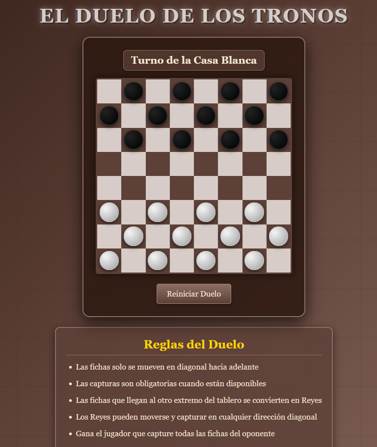

# ⚔️ El Duelo de los Tronos

**El Duelo de los Tronos** es un juego de **Damas Medievales** desarrollado con **HTML, CSS y JavaScript puro**.  
Sumérgete en un reino de sombras donde dos casas luchan por el control del tablero, utilizando estrategia, astucia y movimientos tácticos para alzarte con la victoria.

## 🚀 Demo
  

## 📸 Captura de Pantalla

## 🎮 Características principales

- 🏰 Ambientación medieval con gradientes y tablero estilo antiguo.  
- ⚔️ Fichas que representan caballeros y reyes, con animaciones y efectos visuales.  
- 🔶 Movimiento diagonal estándar y captura obligatoria.  
- 👑 Promoción de fichas a Reyes que pueden moverse y capturar en cualquier diagonal.  
- 🎯 Turnos alternados entre la Casa Blanca (jugador) y la Casa Negra (IA).  
- 💡 Indicadores de movimientos válidos y selección de piezas.  
- 📱 Compatible con **celulares y escritorio**, soportando clicks y toques.  
- 🔄 Reinicio rápido del duelo sin recargar la página.  

## 📂 Estructura del proyecto
### ElDueloDeLosTronos/
### │── index.html
### │── css/
### ├── └── style.css 
### │── js/
### ├── └── game.js
### ├── preview.png 
### └── README.md  

## 🛠️ Tecnologías utilizadas

- **HTML5** → Estructura del juego y tablero.  
- **CSS3** → Estilos, gradientes, animaciones y efectos de luz.  
- **JavaScript** → Lógica de movimientos, IA y detección de capturas obligatorias.  

## 📝 Licencia
Este proyecto está bajo la **MIT License**.  
Libre para usar, modificar y compartir.  

## ⭐ ¿Te gustó el proyecto?
Dejá una ⭐ en GitHub y compartilo con tus amigos.  
**El Duelo de los Tronos** combina **estrategia clásica de damas con ambientación medieval**, ideal para los amantes de los juegos de mesa y la táctica.

# ¡Que comience el duelo! 🛡️🏰
